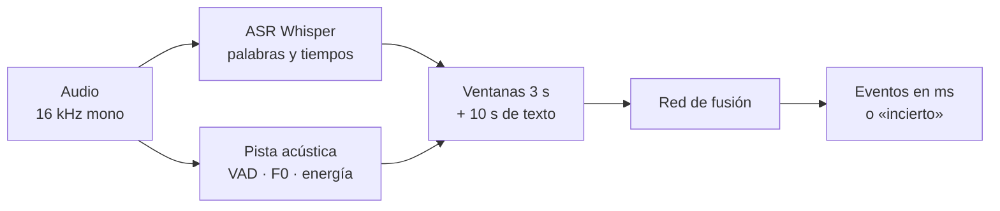
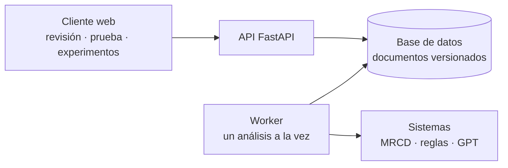
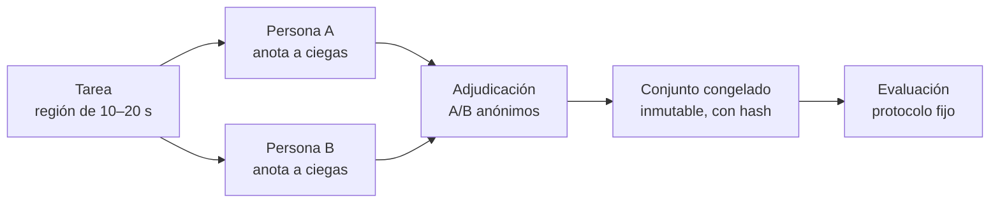

# Cómo funciona

## Del audio a los eventos

1. **Preparación única.** La transcripción y la pista acústica se calculan **una sola vez** por grabación y se guardan en caché por hash del audio y de la configuración. Todas las ventanas y el sistema de reglas reutilizan esa preparación.
2. **Ventanas.** Cada 0,5 s se arma una ventana de 3 s con 300 cuadros acústicos, 9 rasgos prosódicos de la pausa más larga (por ejemplo el reinicio tonal) y hasta 40 palabras de una ventana de texto de 10 s.
3. **Fusión.** La red usa las consultas acústicas para atender a los tokens de texto con su posición temporal. El modelo actual tiene 33 097 parámetros.
4. **Decodificación.** Las ventanas contiguas de la misma clase se unen en un evento. Si la probabilidad no supera el umbral de su clase, el tramo queda como «incierto». Opcionalmente, los bordes se ajustan a las palabras del ASR o al silencio detectado.

## La plataforma

- La API nunca espera a la inferencia: registra el trabajo y responde. El **worker** lo toma de la base de datos, informa el progreso por etapas y escribe el resultado completo en una sola transacción.
- Si el worker se cae, el trabajo vuelve a la cola con un número limitado de reintentos. Repetir un análisis no duplica eventos.
- Cada sistema (MRCD, reglas, GPT) tiene su propio estado. Si uno falla, los demás no se invalidan.

## El ciclo de revisión humana

- **Ciega:** quien anota no ve predicciones, puntuaciones ni el trabajo de otras personas. El servidor no las envía.
- **Cobertura explícita:** una zona sin marcas solo cuenta como «sin eventos» si alguien la declaró revisada.
- **Sin fugas:** un conjunto no se congela si el mismo hablante o el mismo audio aparece en dos particiones (entrenamiento, desarrollo, prueba).

Detalle completo en el [protocolo técnico](protocolo-mrcd.md) y la [guía de anotación](guia-anotacion-v1.md).
